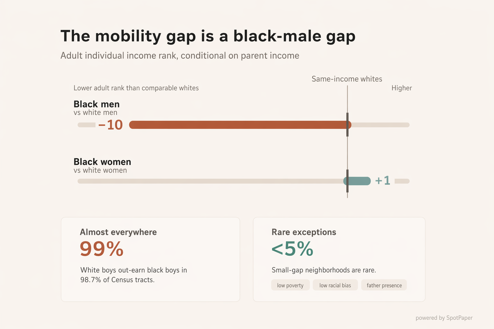
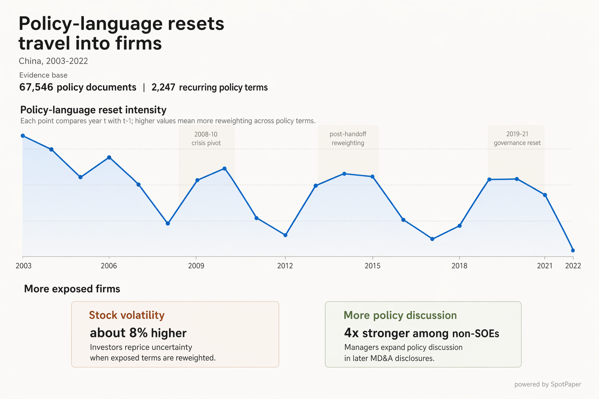

# SpotPaper
Empirical papers, understood at a glance.

## 1. Showcase

Real paper examples generated **end-to-end** by the listed agent/model stack, without manual editing, redrawing, or layout intervention between the paper input and the final output.

<table>
  <tr>
    <td width="50%" valign="top">
      
      <details>
        <summary>Paper</summary>
        <p><em>Race and Economic Opportunity in the United States: an Intergenerational Perspective</em></p>
        <p>Raj Chetty, Nathaniel Hendren, Maggie R. Jones, Sonya R. Porter (2019).</p>
        <p><a href="https://academic.oup.com/qje/article/135/2/711/5687353">paper link</a></p>
      </details>
      <details>
        <summary>Model</summary>
        <p>Codex<br><code>GPT-5.4 high</code><br><code>+ gpt-image-2</code></p>
      </details>
    </td>
    <td width="50%" valign="top">
      
      <details>
        <summary>Paper</summary>
        <p><em>From Rhetoric to Regime: Policy Transitions in China</em></p>
        <p>Sheng Huang and Xi Sun (2026).</p>
        <p><a href="">paper link</a></p>
      </details>
      <details>
        <summary>Model</summary>
        <p>Codex<br><code>GPT-5.5 xhigh</code><br><code>+ gpt-image-2</code></p>
      </details>
    </td>
  </tr>
  <!-- <tr>
    <td width="50%" valign="top">
      
      <details>
        <summary>Paper</summary>
        <p><em>Curriculum and Ideology</em></p>
        <p>Cantoni, Chen, Yang, Yuchtman, and Zhang (2014).</p>
        <p><a href="https://www.davidecantoni.net/pdfs/curriculum_draft_20141215.pdf">paper link</a></p>
      </details>
      <details>
        <summary>Model</summary>
        <p>Codex<br><code>GPT-5.5 medium</code><br><code>+ gpt-image-2</code></p>
      </details>
    </td>
    <td width="50%" valign="top">
      
      <details>
        <summary>Paper</summary>
        <p><em>General Equilibrium Effects of Cash Transfers: Experimental Evidence From Kenya</em></p>
        <p>Dennis Egger, Johannes Haushofer, Edward Miguel, Paul Niehaus, Michael Walker (2022).</p>
        <p><a href="https://emiguel.econ.berkeley.edu/wordpress/wp-content/uploads/2019/11/ecta200500.pdf">paper link</a></p>
      </details>
      <details>
        <summary>Model</summary>
        <p>Claude Code<br><code>Sonnet 4.6</code><br>without polish</p>
      </details>
    </td>
  </tr> -->
</table>

---

## 2. Install

**Claude Code**

```
/plugin marketplace add xisun0/SpotPaper
```

**Codex**

```
$skill-installer https://github.com/xisun0/SpotPaper/tree/main/skills/spotpaper
```

### Prerequisites
 No extra install needed for baseline figure generation beyond what Claude Code or Codex already provides. But if you want to use the polish pass, you will need to set up the OpenAI API and install the Python dependencies.

```bash
pip install openai python-dotenv
```

Add your OpenAI API key to `~/.env`: `OPENAI_API_KEY=sk-...`

<!-- 
---

## What It Does

SpotPaper reads a paper draft or research repo and produces a figure centered on the paper's core argument, not just its topic.

It identifies what should be visualized, chooses a visual grammar that fits the mechanism, drafts the figure, and runs a blind-reader review before stopping.

Best suited for empirical social-science papers — economics, finance, political economy, public policy — where the main finding involves a contrast, channel, or mechanism that can be drawn as structure. -->

## 3. How To Use

Give SpotPaper a paper or repo. It runs through to a final figure without stopping.

### 1. Baseline version

**Input options:**
- local PDF or draft file, or
- local research repo, or
- paper URL

**Demo prompt:**

```
Use spotpaper on /path/to/paper.pdf
Use spotpaper on <https://papers.ssrn.com/sol3/papers.cfm?abstract_id=3114038>
Use spotpaper on this repo <repo_directory>
```
<!-- 
SpotPaper will:

1. Read the paper and extract the core argument
2. Choose a visual grammar (flow, gate, split, divergence, etc.)
3. Write a Python figure script and render a draft
4. Run a blind 10-second read check on a thumbnail
5. Revise if needed, then run a naive-reader review
6. Stop when the figure passes layout and interpretation review -->

Output is saved to a `spotpaper_draft/` folder next to the paper:

```
spotpaper_draft/
  current/
    <figure>.py           ← editable matplotlib script
    <figure>.png          ← rendered figure
    <figure>_thumbnail.png
  snapshots/            ← timestamped backups of each revision
  PAPER_TAKEAWAYS.md
  README.md
```

The `.py` script is plain `matplotlib` — you can open it and adjust colors, labels, layout, or numbers directly before re-running.

### 2. Polished version (optional)

After the figure passes review, SpotPaper will prompt you.

- If you are in the same session:
```
use spotpaper image2 to continue polishing the current figure
```

- If you are starting a new session, specify the file explicitly:

```
Use spotpaper to polish spotpaper_draft/current/figure.png
```

This runs a [`gpt-image-2`](https://platform.openai.com/docs/guides/image-generation) polish pass on the figure — tightening layout, typography, and visual weight without touching the data or argument. Output is saved as `<figure>_polish.png` alongside the original.

> Note: The polish pass calls the OpenAI API and incurs usage costs. At the default setting, each call costs approximately $0.17. See [OpenAI API Pricing](https://openai.com/api/pricing/) for details.


- Alternatively, you can ask for the polish prompt without calling the API. This allows you to use the prompt in ChatGPT or a compatible image editor to polish the figure manually.
```
generate the polish prompt without calling the API 
```


<!-- ## Principles

- Visualize the argument, not just the topic
- Draw structure, not abstract nouns
- One dominant visual sentence per figure
- Numbers only when they are the irreducible message
- Clarity over decoration -->

## 4. FAQ

**1. Why not just attach the paper to an image model?**

The hard part is not generating the image, but translating the paper’s empirical finding into the right visual thesis and chart grammar.  [More...](docs/direct-image-model-comparison.md)
