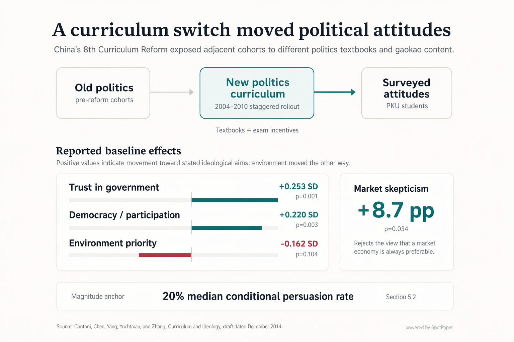

# SpotPaper vs. Direct Image Generation

## Baseline

A natural baseline is to attach the paper PDF to an image model and ask for a presentation-ready figure.

Example prompt:

```text
Read the attached academic paper and create a single presentation-ready visual figure that explains the paper's main empirical finding.

The figure should be suitable for a research talk slide or README showcase. It should communicate the core argument of the paper at a glance, using clear layout, concise labels, and an academic visual style.

Do not create a generic paper summary poster. Make one focused figure, not multiple disconnected panels. Use only information supported by the paper. If exact numbers are uncertain, avoid inventing precise quantitative values.

Include a small attribution in the bottom-right corner: "generated directly by gpt-image-2".
```

This is a fair baseline: it asks for the same end product without giving the model SpotPaper's intermediate workflow.

## Example

| Direct image baseline | SpotPaper |
| --- | --- | 
|  |  |

## What SpotPaper Adds

SpotPaper is designed for the part of figure-making that direct image generation usually skips: deciding what the paper's visual argument actually is.

Before image polish, SpotPaper:

- Extracts the paper's core empirical claim
- Identifies the main contrast, mechanism, and evidence constraints
- Chooses a visual grammar that fits the argument
- Drafts an editable Python figure
- Reviews whether a fresh reader can understand the figure
- Uses image generation only as an optional final polish layer

The showcase figures are generated end-to-end by the listed agent/model stack, without manual editing, hand-redrawing, or manual layout intervention. They are not one-shot image generations from the PDF.

## Comparison Criteria

| Criterion | Direct image generation | SpotPaper |
| --- | --- | --- |
| Argument selection | Often summarizes the paper broadly | Extracts one visualizable empirical claim |
| Visual structure | May default to poster-like layouts | Chooses a grammar such as comparison, channel, flow, split, or mechanism map |
| Evidence discipline | Can invent plausible-looking numbers or relationships | Avoids unsupported quantitative geometry |
| Editability | Usually returns only an image | Produces an editable `matplotlib` script before polish |
| Review | No built-in reader check | Reviews whether the figure is legible to a fresh reader |
| Image generation | Used as the main generation step | Used only as an optional polish step |


## Takeaway

The difference is not just visual style. SpotPaper inserts a paper-aware reasoning workflow between the PDF and the final figure, so the output is more likely to represent the paper's argument rather than a generic visual summary of the paper's topic.
